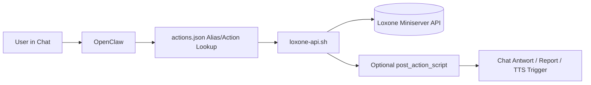
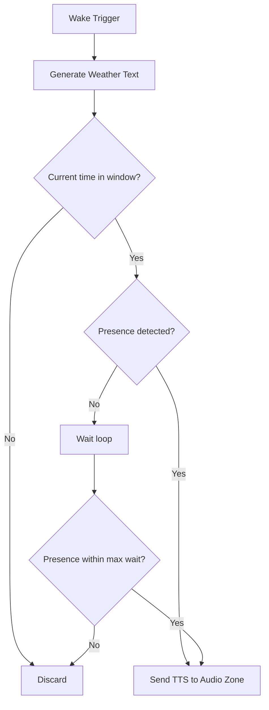
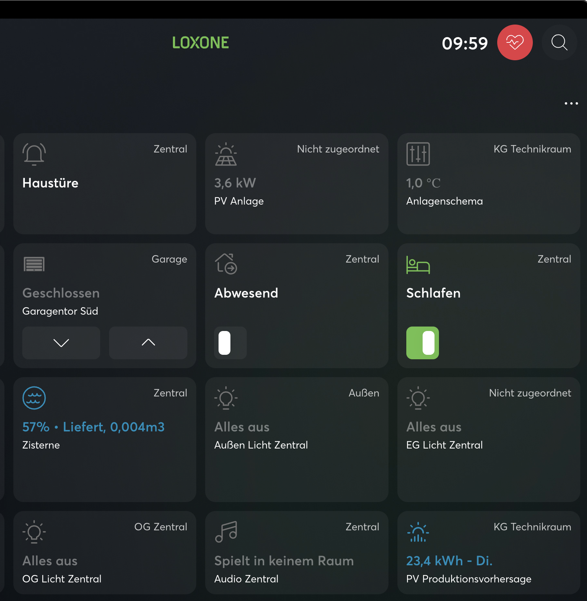
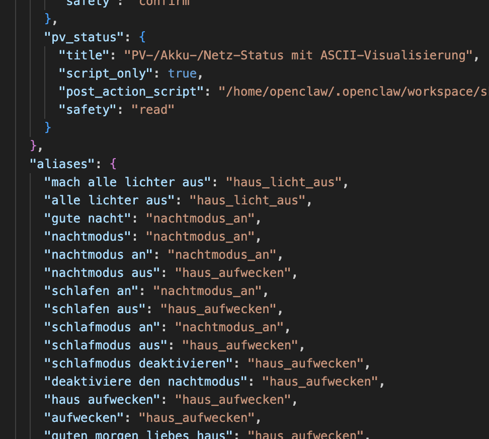
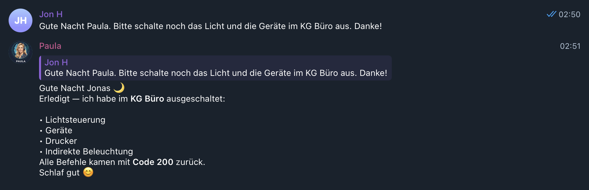
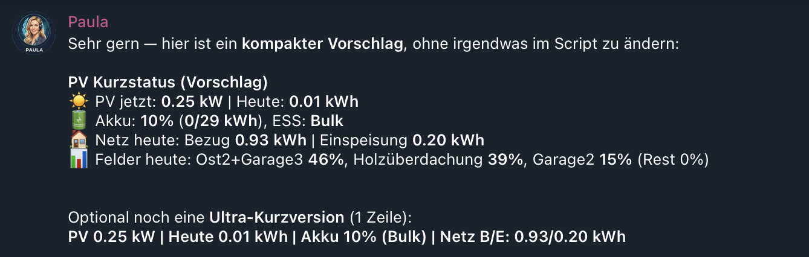

# Loxone Skill for OpenClaw (Community Edition)

> Community-Dokumentation für die Nutzung eines Loxone-Miniserver-Setups mit OpenClaw.

Diese Doku beschreibt ein praxiserprobtes Skill-Setup für:
- Haussteuerung per Chat (z. B. Schlafmodus, Abwesend, Fenster/Rollos)
- Morning-Briefing (Wetter + optionale TTS-Ausgabe in Audio-Zonen)
- zeitgesteuerte Automationen (Cron)
- PV-/Energie-Statusreports und optionale Anomalieerkennung

---

## Inhaltsverzeichnis

1. [Features](#features)
2. [Architektur](#architektur)
3. [Voraussetzungen](#voraussetzungen)
4. [Ordnerstruktur](#ordnerstruktur)
5. [Konfiguration](#konfiguration)
6. [Aktionen & Aliase](#aktionen--aliase)
7. [Morning-Briefing (Text + optional TTS)](#morning-briefing-text--optional-tts)
8. [Scheduler / Cron-Integration](#scheduler--cron-integration)
9. [PV-/Energie-Reports](#pvenergie-reports)
10. [Known Issues & Lösungen](#known-issues--lösungen)
11. [Troubleshooting-Playbook](#troubleshooting-playbook)
12. [Sicherheitshinweise](#sicherheitshinweise)
13. [Sektion für Screenshots](#sektion-für-screenshots)
14. [Beispiel-Workflows](#beispiel-workflows)
15. [Lizenz / Community-Hinweise](#lizenz--community-hinweise)

---

## Features

- **Textbasierte Haussteuerung** über natürliche Sprache
- **Action-Mapping** mit stabilen IDs/Control-Namen
- **Schlafmodus-Flow** (an/aus) mit optionalem Folgeprozess
- **Morning-Briefing** mit Wetter in komprimierter oder ausführlicher Form
- **Optionales Audio-Briefing via Loxone TTS**
- **Präsenzgesteuerte Ausspielung** (z. B. nur bei Bewegung im Raum)
- **Zeitfensterlogik** (z. B. nur morgens zwischen 06:00–11:00)
- **Cron-fähig** für wiederkehrende Aufgaben
- **PV-/Energie-Statusberichte** inkl. Tagesdeltas aus `/stats`

---

## Architektur

Steuerfluss (Chat → Aktion → Loxone)



## Beispielflow - Morning-Briefing mit Präsenz- und Zeitfensterlogik



---

## Voraussetzungen

- Laufender **OpenClaw Gateway**
- Zugriff auf **Loxone Miniserver** im gleichen Netz
- API-Benutzer mit ausreichenden Rechten (lesen/schalten, optional Audio/TTS)
- Empfehlung: Zugriff auf den Miniserver auf lokales Netzwerk beschränken
- Installierte Hilfstools:
  - `bash`
  - `curl`
  - `jq`
  - `python3`
- Optional für Wetter:
  - Zugriff auf `wttr.in` oder alternative Wetterquelle

---

## Ordnerstruktur

Empfohlene Struktur im Workspace:

```text
skills/loxone/
├─ SKILL.md
├─ config.example.json
├─ actions.example.json
├─ loxone-api.sh
├─ wake-weather-report.sh         # optional
├─ wake-weather-tts.sh            # optional
├─ pv-status-report.sh            # optional
├─ pv-anomaly-monitor.py          # optional
├─ pv-sunset-report-monitor.sh    # optional
├─ pv-day-overrides.example.json  # optional
├─ loxone-controls-inventory.example.csv 
└─ references/
   ├─ workflows.md
   └─ data-sources.md
```

---

## Konfiguration

### `config.example.json` (anonymes Beispiel)

```json
{
  "hostFile": "/path/to/credentials/loxone-host",
  "user": "<API_USER>",
  "passwordFile": "/path/to/credentials/loxone-password",
  "insecure_tls": true,
  "scenes": {
    "Kinderzimmer öffnen": "VirtualInput_KinderzimmerOpen"
  }
}
```

> Durch das Password-File werden keinerlei Passwörter in den Scripten abgelegt.

### Credential-Dateien (Beispiel)

- `loxone-host`: `https://<loxone-host-or-ip>`
- `loxone-password`: `<secret>`

> Empfehlung: Datei-Rechte restriktiv setzen (`chmod 600`).


---

## Aktionen & Aliase

### `actions.example.json` – Prinzip

- Definiert technische Aktion (`control`, `command`)
- Definiert natürliche Alias-Sätze
- Unterstützt `post_action_script` für Folgeaktionen

### Anonymes Beispiel

```json
{
  "actions": {
    "sleep_mode_on": {
      "title": "Schlafmodus aktivieren",
      "control": "SleepSwitch",
      "command": "On"
    },
    "sleep_mode_off": {
      "title": "Schlafmodus deaktivieren",
      "control": "SleepSwitch",
      "command": "Off",
      "post_action_script": "/.../wake-weather-report.sh"
    }
  },
  "aliases": {
    "schlafmodus an": "sleep_mode_on",
    "schlafmodus aus": "sleep_mode_off"
  }
}
```

---

## Morning-Briefing (Text + optional TTS)

### Text-Briefing

Ein Script erzeugt kompakten Wettertext (z. B. aktuelle Temperatur, Tagesbereich, Regenwahrscheinlichkeit).

### TTS-Briefing (optional)

Empfohlene Regeln:
- Textlänge **hart begrenzen** (z. B. 300 Zeichen)
- Zeitfenster prüfen (z. B. nur morgens)
- Präsenz im Raum prüfen
- Maximalwartezeit (z. B. 60 Minuten), danach verwerfen

Pseudo-Logik:
1. Wake-Event
2. Wettertext erzeugen
3. Wenn außerhalb Zeitfenster: verwerfen
4. Wenn Präsenz aktiv: sofort TTS
5. Sonst poll-basiert warten bis Präsenz oder Timeout

---

## Scheduler / Cron-Integration

Typische Jobs:
- Werktags morgens: Virtuellen Eingang triggern
- Optional Wochenendzeit separat
- Morning-Briefing (nur bei bestimmten Bedingungen)
- PV-/Energieberichte am Abend

Empfehlung:
- Keine übermäßig häufigen Jobs mit Push-Nachrichten an Endnutzer
- Für Debug-Phasen temporär aktivieren, danach drosseln/deaktivieren

---

## PV-/Energie-Reports

Robustes Muster:
- Live-Werte über `jdev/sps/io/...`
- Tageswerte bevorzugt aus `/stats/...xml` berechnen (Delta)
- Fallbacks definieren, wenn einzelne `totalDay`-Werte 0 liefern

Berichtsblöcke:
- Aktuelle Leistung
- Tagesertrag
- Akku (SOC, Laden/Entladen)
- Netzbezug/Einspeisung

---

## Known Issues & Lösungen

### 1) TTS wird abgeschnitten
**Symptom:** Ansage endet mitten im Satz.
- **Ursache:** Text zu lang
- **Lösung:** Hard-Limit (z. B. 300 Zeichen inkl. Leerzeichen), notfalls mit `…` kürzen

### 2) „Schlafmodus aus“ ohne Briefing
**Symptom:** Schalter wird deaktiviert, aber keine Ansage/kein Report.
- **Ursache:** `post_action_script` fehlt auf direkter Aktion oder Alias zeigt auf andere Action
- **Lösung:** Briefing auf allen relevanten Actions anhängen (`sleep_mode_off`, `wake_house`)

### 3) Trigger ausgeführt, aber Gerät reagiert nicht
**Symptom:** Cron läuft „ok“, physisch passiert nichts.
- **Ursache:** Falscher Control/Virtual Input, Logikfehler im Loxone-Projekt
- **Lösung:** Control in Inventar/Structure prüfen, API-Pfad und Loxone-Logik gegenvalidieren

### 4) Feiertags-/Wochentagslogik führt zu „nichts passiert“
**Symptom:** Job wurde ausgelöst, aber Script überspringt.
- **Ursache:** Schutzlogik (Holiday API, DOW-Guard)
- **Lösung:** Logs prüfen, explizite Statuszeile ausgeben („übersprungen wegen Feiertag“)

### 5) Präsenzgesteuertes TTS wird nie abgespielt
**Symptom:** Kein Audio trotz Wake-Event.
- **Ursache:** Sensor-UUID falsch, falscher State-Key, Zeitfenster verfehlt
- **Lösung:** Sensoren einzeln per API testen (`/active`), Poll-Intervall/Timeout prüfen

### 6) JSON-/Shell-Parsing-Bugs (häufig)
**Symptom:** Skript läuft, aber Variablen leer/kaputt.
- **Ursache:** unrobustes Parsing, unquoted vars
- **Lösung:** `set -euo pipefail`, korrektes Quoting, `jq` nutzen, Syntaxchecks in CI

---

## Troubleshooting-Playbook

### Basischecks

```bash
# Config valide?
jq empty skills/loxone/config.json
jq empty skills/loxone/actions.json

# Shell-Syntax
bash -n skills/loxone/*.sh

# Python-Syntax
python3 -m py_compile skills/loxone/*.py
```

### API-Schnelltest

```bash
# Beispielstatus (anonym)
curl -sk -u "<user>:<pass>" "https://<host>/jdev/sps/io/<control>/state"
```

### Action-Test

```bash
bash skills/loxone/loxone-api.sh list_actions
bash skills/loxone/loxone-api.sh run_action <action_id>
```

### Debug-Empfehlung

- Jeder Automation-Lauf sollte eine **klare Statusmeldung** erzeugen:
  - ausgeführt
  - übersprungen (mit Grund)
  - Fehler (mit Kurzgrund)

---

## Sicherheitshinweise

- Keine Klartext-Passwörter in Repo oder Doku
- Credentials über getrennte Dateien / Secret Store
- TLS möglichst mit validem Zertifikat (statt `insecure_tls`)
- Eigener Loxone-API-User mit minimalen Rechten
- Keine UUIDs/Innenraumbezeichnungen öffentlich posten

---

## Sektion für Screenshots

1. **Loxone App**


2. **Action-Mapping in `actions.json`**


3. **Beispiel-Chat-Kommandos und Antworten**



4. **PV-Report-Beispielausgabe**


5. **PV-Anomalie-Report**


---

## Beispiel-Workflows

### A) Schlafmodus deaktivieren + Morning-Briefing
1. User sagt „Schlafmodus aus“
2. Alias → Action `sleep_mode_off`
3. Action schaltet Sleep-Switch auf `Off`
4. `post_action_script` erzeugt Wetterbericht
5. Optional TTS wird zeit-/präsenzgesteuert abgespielt

### B) Kinderzimmer öffnen per virtuellem Eingang
1. Cron zur definierten Uhrzeit
2. Script prüft Tag/Feiertag
3. Script triggert Virtual Input (Pulse)
4. Statuszeile wird zurückgegeben

---

## Lizenz

Dieses Projekt steht unter der **MIT License**.

- Vollständiger Lizenztext: [`LICENSE`](./LICENSE)
- Kurz erklärt: Nutzung, Änderung, Verteilung und kommerzielle Nutzung sind erlaubt,
  solange Copyright- und Lizenzhinweis erhalten bleiben.
- Haftung/Gewährleistung: ausgeschlossen ("AS IS").

Contributions sind willkommen.

---

## Quick Start (ultra-kurz)

1. `config.json` + Credentials anlegen
2. Controls/Virtual Inputs in `actions.json` mappen
3. `loxone-api.sh` lokal testen
4. `wake-weather-report.sh` testen
5. Optional `wake-weather-tts.sh` mit Präsenzlogik aktivieren
6. Cron-Jobs schrittweise aktivieren

Viel Erfolg beim Nachbauen 🚀
